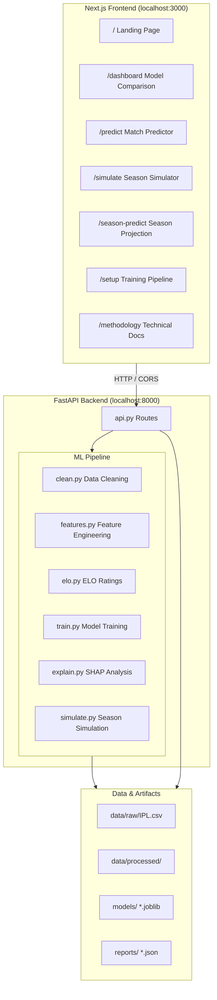
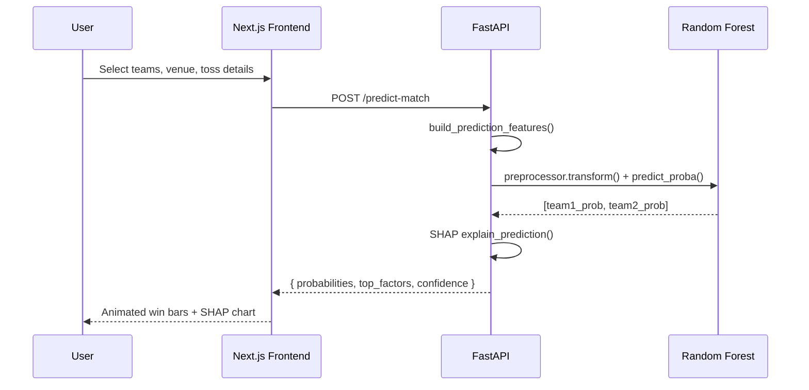
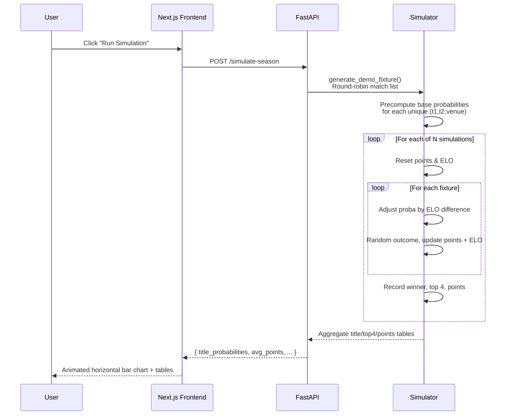
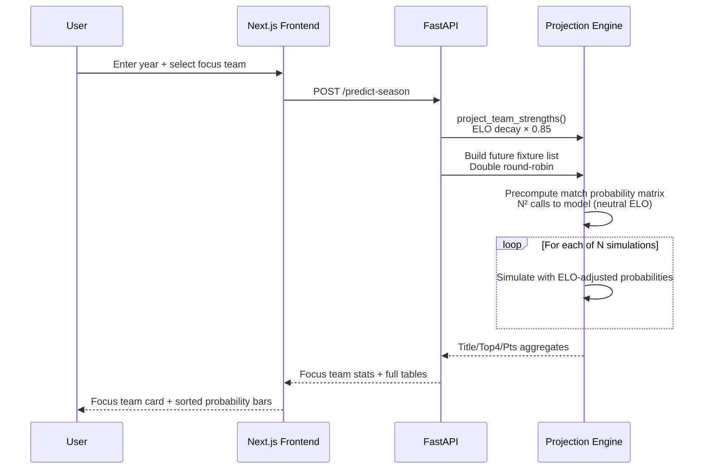
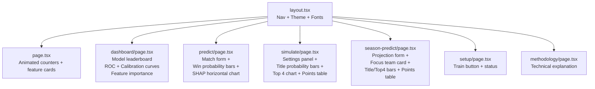
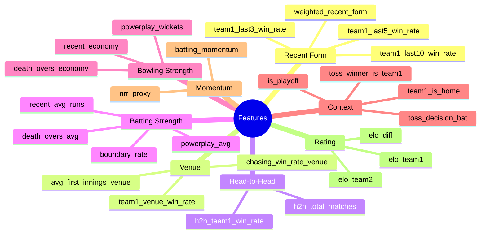
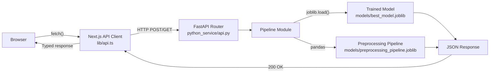

# IPL Forecast Engine — Architecture

## System Overview

---

## Data Pipeline

```mermaid
flowchart LR
    A["IPL.csv<br/>Ball-by-ball data"] --> B["clean.py<br/>Remove leaked columns<br/>Rename teams<br/>Filter incomplete matches"]
    B --> C["Cleaned Dataset<br/>data/processed/cleaned_dataset.csv"]
    C --> D["aggregate_innings()<br/>Roll up ball-by-ball → innings level"]
    D --> E["build_match_features()<br/>Merge innings → match level<br/>Set team1/team2 consistently"]
    E --> F["compute_elo_ratings()<br/>Iterative ELO after each match"]
    F --> G["Feature Engineering<br/>Recent form (3/5/10 matches)<br/>Venue stats<br/>Head-to-head<br/>Batting/bowling strength<br/>Momentum<br/>NRR proxy"]
    G --> H["Engineered Features<br/>data/processed/engineered_match_features.csv"]
    H --> I["Time-Based Split<br/>2007/08–2024 Train<br/>2025 Val<br/>2026 Test"]
    I --> J["Train 4 Models<br/>LogisticRegression<br/>RandomForest<br/>XGBoost<br/>CatBoost"]
    J --> K["Select Best<br/>(Random Forest)"]
    K --> L["Save Artifacts<br/>models/best_model.joblib<br/>models/preprocessing_pipeline.joblib"]
    K --> M["SHAP Explanations<br/>reports/feature_importance.json"]
```

---

## Match Prediction Flow

---

## Season Simulation Flow

---

## Season Projection Flow

---

## Frontend Component Tree

---

## Feature Engineering Groups

---

## Request / Response Flow

